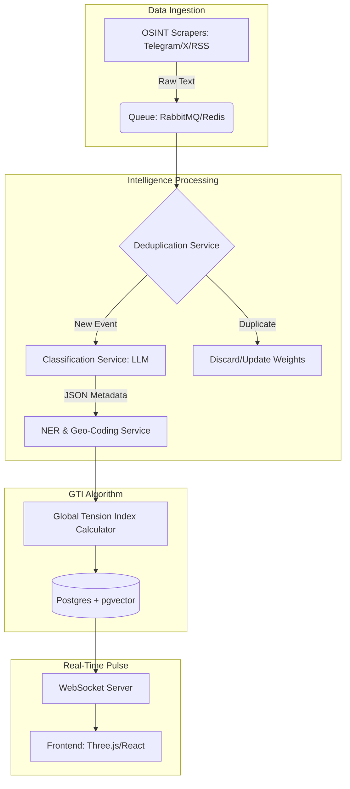
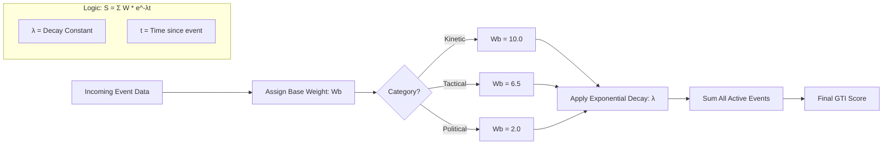
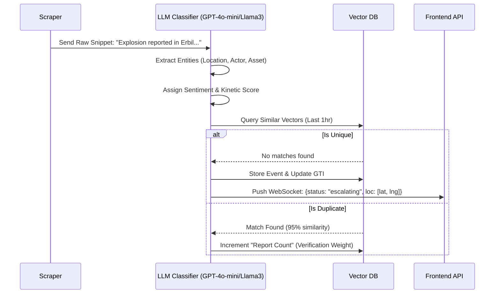

# Antigravity PRD: Event-Driven AI & GTI Architecture

## 1. System Overview: The High-Level Flow
This diagram tracks the lifecycle of a geopolitical event from a raw "ping" to a visual "pulse" on the 3D globe.

## 2. The GTI (Global Tension Index) Logic
The "Antigravity" scoring logic uses Time-Decay. A strike happening now is exponentially more relevant than a strike from 48 hours ago.

## 3. Microservice Deep-Dive: The AI Agent
This defines how the "Vibe" is extracted from messy human language into structured data.

## 4. Technical Specs for "Vibe Coding"
To get this running quickly, focus on these three interfaces:

| Microservice | Language/Framework | Critical Tech |
|---|---|---|
| Ingestor | Python (FastAPI) | Playwright for scraping, Pydantic for schemas. |
| The Brain | Python | LangChain or Instructor for structured JSON output. |
| GTI Engine | Node.js / Go | Redis for the real-time counter (fast increments). |
| Visualizer | React | react-three-fiber + Globe.gl for the 3D map. |
